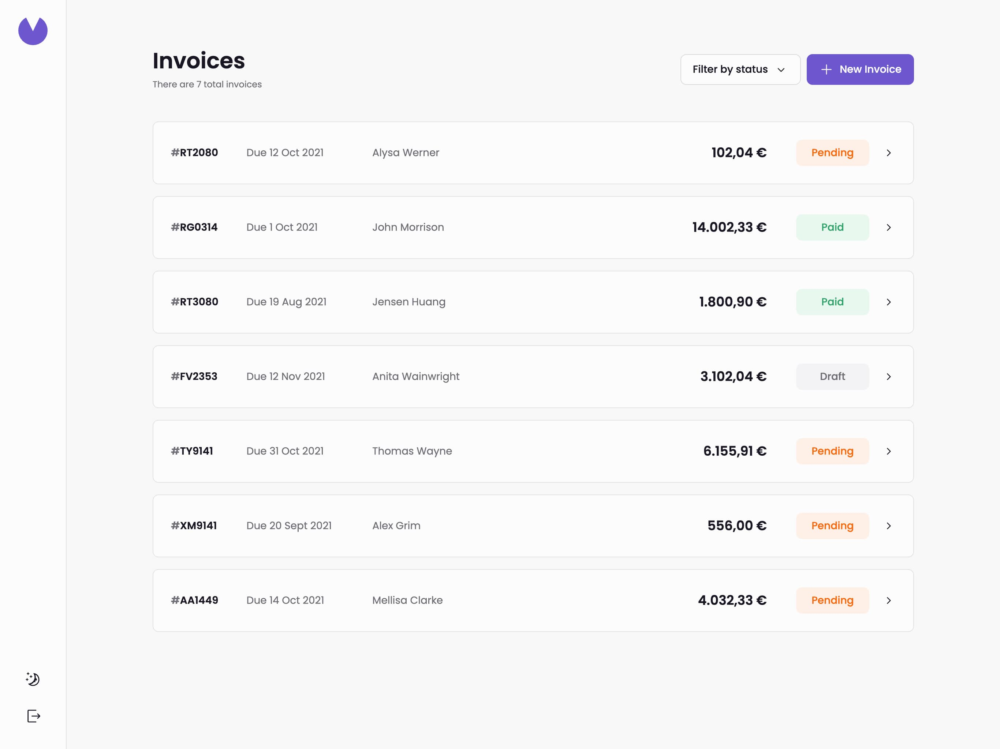

# Frontend Mentor - Invoice app solution

This is a solution to the [Invoice app challenge on Frontend Mentor](https://www.frontendmentor.io/challenges/invoice-app-i7KaLTQjl). Frontend Mentor challenges help you improve your coding skills by building realistic projects.

## Table of contents

- [The challenge](#the-challenge)
- [Screenshot](#screenshot)
- [Links](#links)
- [Built with](#built-with)
- [Demo user](#demo-user)

## The challenge

Users should be able to:

- View the optimal layout for the app depending on their device's screen size
- See hover states for all interactive elements on the page
- Create, read, update, and delete invoices
- Receive form validations when trying to create/edit an invoice
- Save draft invoices, and mark pending invoices as paid
- Filter invoices by status (draft/pending/paid)
- Toggle light and dark mode
- **Bonus**: Keep track of any changes, even after refreshing the browser (`localStorage` could be used for this if you're not building out a full-stack app)

## Screenshot

## Links

- Solution URL: [frontendmentor.io/solutions/invoice-app-U32prWfzFE](https://www.frontendmentor.io/solutions/invoice-app-U32prWfzFE)
- Live Site URL: [mcornale-invoice-app.netlify.app](https://mcornale-invoice-app.netlify.app/invoices)

## Built with

- React
- CSS
- Typescript
- Radix UI
- Remix

## Demo user

I've created a demo user so you can have a look at the application with some sample data.
Here's the user credentials:

- username: `demo`
- password: `demo123`
